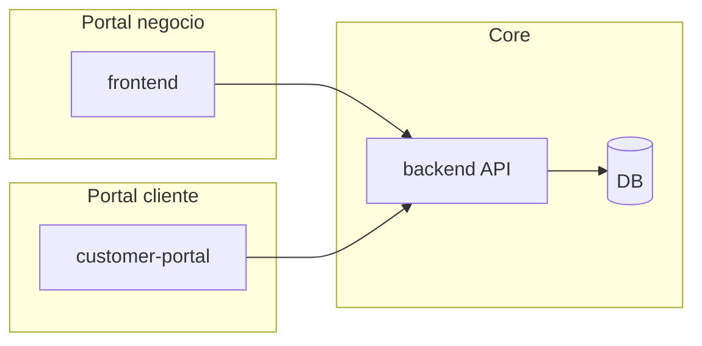

# Arquitectura SaaS — Salones (multi-tenant)

Este repositorio ya separa **tres capas de producto**. Este documento enlaza tu modelo mental con **carpetas, apps y API** para que el equipo sepa dónde vive cada cosa y qué falta por construir.

## Vista de alto nivel

| Pilar | App / carpeta | Rol |
|--------|----------------|-----|
| **Portal del negocio** | `frontend/` (Next.js, panel interno) | Staff del salón: agenda, CRM, catálogo, pagos internos, reportes |
| **Portal del cliente** | `customer-portal/` (Next.js) | Cliente final por `/:slug/*` (reservas, citas, perfil) |
| **Core SaaS** | `backend/` (Laravel API) | Multi-tenant, auth, permisos, facturación de la plataforma (Stripe/Cashier), webhooks, datos |

Infra: `compose.yml`, `.devcontainer/devcontainer.json`.

---

## 1. Portal del negocio (`frontend/`)

Rutas bajo `frontend/pages/`. Componentes reutilizables bajo `frontend/components/`. Cliente HTTP por dominio en `frontend/lib/api/`.

### Operación diaria

| Capacidad | Ruta UI | API (prefijo típico) | Notas |
|-----------|---------|----------------------|--------|
| Agenda / calendario | `/agenda` | `GET /agenda/day`, `week` | |
| Gestión de citas | (dentro de agenda + modales) | `appointments` | CRUD + `move` |
| Disponibilidad por profesional | `/working-hours` (pestaña horarios) | `working-hours` | |
| Bloqueos / horarios especiales | `/working-hours?tab=blocks` | `blocks` | |

### Profesionales

| Capacidad | Ruta UI | API | Estado |
|-----------|---------|-----|--------|
| Perfiles, servicios asignados | `/professionals` | `professionals`, `services/{id}/professionals` | Hecho |
| Horarios individuales | `/working-hours` | `working-hours` | Hecho |
| Comisiones, KPIs | — | — | Roadmap |

### Servicios

| Capacidad | Ruta UI | API |
|-----------|---------|-----|
| Catálogo / categorías | `/service-categories`, `/services` | `service-categories`, `services` |
| Duración, precio | `/services` | `services` |
| Variantes (combinados) | `/combined-services`, `/service-relations` | `combined-services` |

### Clientes (CRM)

| Capacidad | Ruta UI | API |
|-----------|---------|-----|
| Ficha, historial | `/clients`, historial en detalle | `clients`, `clients/{id}/history` |
| Notas / medios | (modal cliente) | `clients/{id}/media` |
| Preferencias, segmentación | Parcial según modelo | Roadmap explícito |

### Pagos y facturación

| Capacidad | Ruta UI | API / notas |
|-----------|---------|-------------|
| Cobros en negocio | `/payments` | `payments` |
| **Facturación del SaaS** (plan Stripe) | Menú usuario → Facturación → `/billing` | `billing/*` (propietario) |
| Propinas, suscripciones al cliente | — | Roadmap |

### Inventario

| Capacidad | Ruta UI | API |
|-----------|---------|-----|
| Productos | `/products` | `products` |
| Stock / ajustes | `/inventory` | `inventory/stocks`, `inventory/adjust` |
| Consumo por servicio | Relación materiales-servicio (API) | `services/{id}/materials` |

### Marketing

| Capacidad | Ruta UI | API |
|-----------|---------|-----|
| Recordatorios / automatizaciones | `/automations` | `automations` |
| Cupones, campañas WhatsApp/email | — | Roadmap |

### Analytics

| Capacidad | Ruta UI | API |
|-----------|---------|-----|
| Resúmenes | `/dashboard` | `dashboard` |
| Reportes | `/reports` | `reports/*` |

### Configuración

| Capacidad | Ruta UI | API |
|-----------|---------|-----|
| Branding / onboarding negocio | `/profile` (paneles según rol) | `business-setup`, `me` |
| Sucursales | `/branches` | `branches` |
| Políticas generales | Parcial | Ampliar según negocio |

---

## 2. Portal del cliente (`customer-portal/`)

Rutas dinámicas `pages/[slug]/...`.

| Área | Rutas actuales | API |
|------|----------------|-----|
| Descubrimiento / reserva | `/[slug]/book` | `GET /public/{business}/services`, `professionals`, `availability` |
| Auth cliente | `/[slug]/login`, `/[slug]/register` | `public/.../customer/register`, `login` |
| Agenda cliente | `/[slug]/book`, `/[slug]/appointments` | `customer/book`, `customer/appointments` |
| Perfil | `/[slug]/profile` | `customer/me` (según implementación) |

**Roadmap** respecto a tu árbol: pagos online, puntos/membresías, notificaciones in-app, favoritos explícitos.

---

## 3. Core SaaS (`backend/`)

| Responsabilidad | Dónde está |
|-----------------|------------|
| Multi-tenant | `EnsureTenantIsolation` + `business_id` en modelos |
| Billing plataforma | `BillingController`, Cashier, `STRIPE_*`, `BILLING.md` |
| Roles y permisos | Spatie, `role:*` middleware, `config/permission.php` |
| API REST | `routes/api.php` |
| Reserva pública | `PublicBookingController`, `PublicCustomerAuthController` |
| Auditoría / logs | Laravel log; ampliar si necesitas auditoría de dominio |
| Escalabilidad | Colas, caché, DB — según despliegue (`compose.yml`) |

---

## Cómo evolucionar el código sin perder el mapa

1. **Nueva feature de negocio**: página en `frontend/pages/<dominio>/`, componentes en `frontend/components/<dominio>/`, API en `backend` y entrada en **esta tabla**.
2. **Nueva feature solo cliente**: `customer-portal/pages/[slug]/...` + endpoints bajo `public/{business}` o `auth:client`.
3. **Cruce tenant / plataforma**: siempre en `backend` con middleware adecuado; nunca mezclar datos de dos `business_id`.

---

## Referencia rápida de prefijos API

- Panel staff (auth + `tenant.isolation`): ver `backend/routes/api.php` grupo principal.
- Público reserva: `public/{business}/...`.
- Webhook Stripe: `POST /stripe/webhook`.
